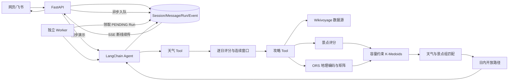

# Weather-aware Travel Planner Agent

一个面向全球城市的多工具旅行规划 Agent 原型。它先用确定性算法从近期预报中选择连续天气窗口，再从 Wikivoyage 提取景点，结合用户兴趣评分、OpenRouteService（ORS）交通矩阵、容量约束 K-Medoids 和匈牙利算法，生成按天气分配的多日路线。

当前项目重点是“可解释的 Tool 与 Agent 编排”。目前已提供 FastAPI、持久化会话/消息/Run、独立 Worker 和 SSE 进度事件；酒店搜索、携程等供应商适配与生产级分布式运行时仍在路线图中。

## 工作流与架构



`weather_window.py` 是显式应用入口；导入任何模块都不会创建模型、调用 LLM 或发起 HTTP 请求。

| 模块 | 职责 |
| --- | --- |
| `weather_tool.py` | Open-Meteo 查询、天气归一化评分、连续日期窗口 |
| `travel_planner/schemas.py` | Pydantic 输入和领域对象 |
| `travel_planner/sources.py` | Wikivoyage API、Listing 解析与去重 |
| `travel_planner/scoring.py` | 完整度、跨页面、编辑推荐、兴趣、新鲜度与惩罚 |
| `travel_planner/clustering.py` | 容量约束 K-Medoids |
| `travel_planner/routing.py` | ORS 地理编码/矩阵、日内开放路径和时间轴 |
| `travel_planner/weather_assignment.py` | 天气恶劣度与匈牙利最小成本匹配 |
| `travel_planner/service.py` | 确定性业务编排、日志和失败降级 |
| `travel_planner/tool.py` | LangChain Tool 适配 |
| `travel_planner_tool.py` | 旧导入路径兼容层 |
| `app/main.py` | FastAPI 路由、同步调用、Run API 与 SSE |
| `app/models.py` | Session、Message、AgentRun、RunEvent 持久化模型 |
| `app/worker.py` | 独立进程领取并执行耗时 Agent Run |
| `app/callbacks.py` | 将模型/Tool 生命周期写成持久化进度事件 |

详细决策见 [ADR 0001](docs/adr/0001-modular-travel-planner.md)、[ADR 0002](docs/adr/0002-secrets-and-runtime-side-effects.md) 和 [ADR 0003](docs/adr/0003-durable-worker-and-sse.md)。

## 数据源

| 数据源 | 用途 | 授权/归属 | 已知限制 |
| --- | --- | --- | --- |
| Open-Meteo | 地理编码、未来逐日天气 | 响应中保留数据源信息 | 实时逐日窗口最多约 16 天，远期预报不确定 |
| Wikivoyage MediaWiki Action API | 城市页面、See/Do Listing、描述、开放时间等 | 内容署名 Wikivoyage contributors，CC BY-SA 4.0 | 全球语言版覆盖和维护质量不均；不是点评/热度全量库 |
| OpenRouteService | POI 地理编码、时间与距离矩阵 | ORS API | 需要 `ORS_API_KEY`；当前仅步行、驾车、骑行，不含公交班次 |
| DeepSeek | 意图识别、Tool 调用与结构化回答 | 供应商 API | 需要 `DEEPSEEK_API_KEY`；模型只组织流程，不替代确定性算法 |

项目不依赖绕过登录、反爬或验证码的小红书/携程抓取。接入酒店或票务时应优先使用获得授权的开放 API、联盟 API 或测试环境，并在支付前加入明确的人类确认。

## 安装与运行

要求 Python 3.13 和 [uv](https://docs.astral.sh/uv/)。

```powershell
uv sync --dev
Copy-Item .env.example .env
```

在本地 `.env` 中填写自己的值；`.env` 已被 `.gitignore` 忽略，不能提交：

```dotenv
DEEPSEEK_API_KEY=your_deepseek_key
ORS_API_KEY=your_ors_key
WIKIMEDIA_USER_AGENT=TravelPlannerAgent/0.1 (contact: you@example.com)
LOG_LEVEL=INFO
PYTHONUTF8=1
DATABASE_URL=sqlite:///./resources/agent_api.db
```

运行完整 Agent：

```powershell
uv run python weather_window.py "帮我规划近期去上海连续游玩3天的旅游攻略，我喜欢历史和建筑"
```

只运行天气 Tool（不调用 LLM）：

```powershell
uv run python weather_tool.py
```

后端代码可显式创建 Agent，不会因导入而产生请求：

```python
from weather_window import create_travel_agent

agent = create_travel_agent()
```

生产部署不应加载文件型 `.env`，而应由容器平台、Vault/KMS 或 CI/CD Secret 将密钥注入进程环境。

## FastAPI、Worker 与 SSE

本地开发需要打开两个 PowerShell。第一个启动 API：

```powershell
uv run uvicorn app.main:app --reload --env-file .env
```

第二个启动独立 Worker：

```powershell
uv run python -m app.worker --env-file .env
```

启动后访问 `http://127.0.0.1:8000/docs` 查看自动生成的 OpenAPI 文档。

| 接口 | 作用 |
| --- | --- |
| `POST /v1/agent/invoke` | 同步调用现有 Agent，适合开发演示 |
| `POST /v1/sessions` | 创建会话 |
| `POST /v1/sessions/{id}/messages` | 保存用户消息并返回 `PENDING` Run |
| `GET /v1/runs/{run_id}` | 查询 Run 状态和最终结构化结果 |
| `GET /v1/runs/{run_id}/events` | SSE 进度流，支持 `Last-Event-ID` 续传 |
| `POST /v1/runs/{run_id}/cancel` | 取消待执行任务；运行中任务在 Tool 边界协作取消 |

推荐客户端工作流是“创建 Session → 提交 Message → 连接 events_url → 完成后读取 Run”。同步接口会占用一个服务线程，不应作为高并发生产入口。默认 SQLite 数据库兼作本地持久化队列；它支持单机 Demo 和单/少量 Worker，生产环境应迁移 PostgreSQL，并在多机规模下换成 Redis/RabbitMQ 等专用队列。

## 测试

```powershell
uv run pytest
python -m py_compile weather_tool.py weather_window.py travel_planner_tool.py
```

默认测试完全离线，覆盖天气算法、攻略解析、评分/聚类/路由、统一错误结构、导入零副作用，以及 FastAPI 同步调用、Session/Message/Run、Worker、取消、SSE 回放和断线续传。实时第三方 API 测试必须标记为 `integration`，不能进入默认快速测试。

## 演示截图


截图展示离线测试方式；当前本地回归结果为 `17 passed`。实际行程内容依赖实时天气、Wikivoyage 页面和 ORS 配额，因此不把一次运行结果当成稳定测试快照。

## 错误、日志与编码约定

所有可恢复 Tool 失败使用相同 JSON 结构：

```json
{
  "status": "error",
  "error_code": "MISSING_ORS_API_KEY",
  "message": "缺少 ORS_API_KEY...",
  "details": {},
  "query_city": "上海"
}
```

入口通过 `logging_config.py` 输出 UTF-8 JSON Lines，字段包括 UTC 时间、级别、logger、event、tool_name、city、request_id 和稳定错误码。`.editorconfig`、`.gitattributes` 与 `PYTHONUTF8=1` 用于统一 UTF-8；不要用日志记录密钥、Cookie 或原始个人信息。

## 当前限制与路线图

- 天气只能在数据源的近期预报范围内可靠筛选，不能回答数月后的“最佳三天”。
- Wikivoyage 是全球多语言社区数据，不保证每个城市都有足够结构化 Listing；开放时间、票价、停业状态必须出发前到官网复核。
- ORS 地理编码可能误匹配同名景点；低于置信度阈值的结果会被拒绝，但仍需人工复核。
- 路线是估算结果，尚未包含实时拥堵、公交班次、预约时段、无障碍和跨日行李约束。
- 尚未实现酒店/机票只读搜索、供应商适配层、人工确认和支付；不得用抓取脚本代替授权预订接口。
- 本地运行时使用 SQLite 数据库队列；尚未加入 PostgreSQL 迁移、Redis/RabbitMQ、租约超时、崩溃后自动回收 RUNNING 任务和多 Worker 压测。
- 当前支持 SSE 事件重放和协作取消，但没有暂停/恢复 checkpoint、身份认证、配额、OpenTelemetry 和分布式追踪。

建议下一阶段按顺序完成：Alembic 与 PostgreSQL → 用户身份/偏好 → 任务租约与重试 → OpenTelemetry → 酒店只读推荐及人工确认 → 飞书 Bot。

## GitHub 协作

仓库已使用 `main` 分支并绑定 GitHub。后续按 [CONTRIBUTING.md](CONTRIBUTING.md) 将 Schema/安全、模块拆分、测试、文档等变更拆成可审查提交，并用 `.github/ISSUE_TEMPLATE` 记录需求和缺陷。架构变化继续追加 ADR，不改写已经 Accepted 的历史决策。

提交前至少确认：

```powershell
git status --short
git check-ignore .env
git diff --check
uv run pytest
```

若 `.env` 或密钥曾进入任何提交，加入 `.gitignore` 不能消除泄露：必须立即轮换密钥，并在推送前清理 Git 历史。
